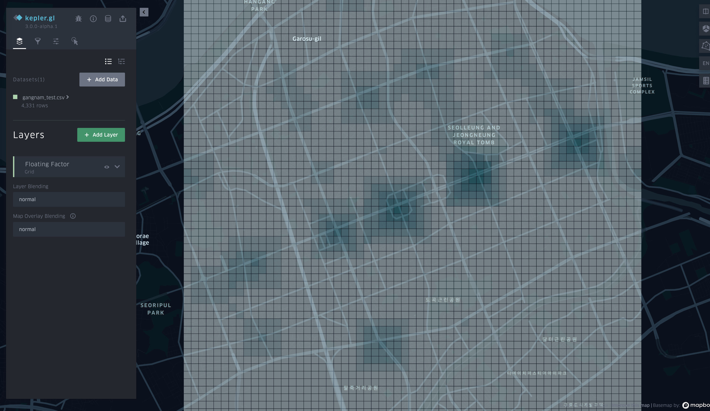

# Using various data to figure out Central Business District

Using Various data and kepler.gl I will try to figure out the central business district.

## Project Detail

`asset` directory contains all the publicly collected data. `generate` 
directory contains all the data generated by the code. 

## 1. 서울시 지하철 유동인구

### Process
